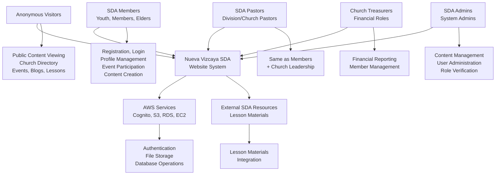
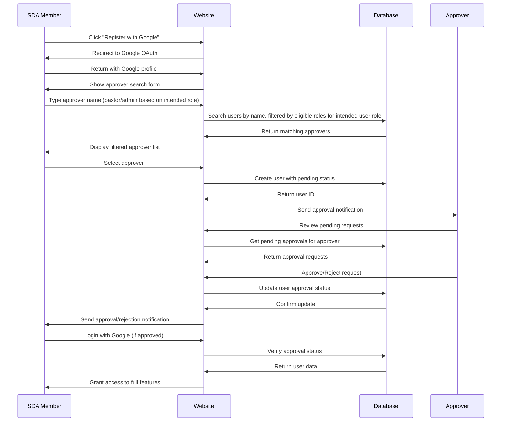
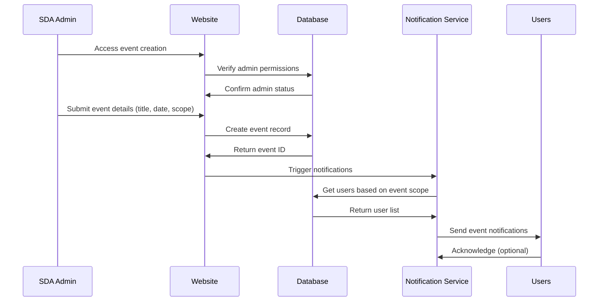
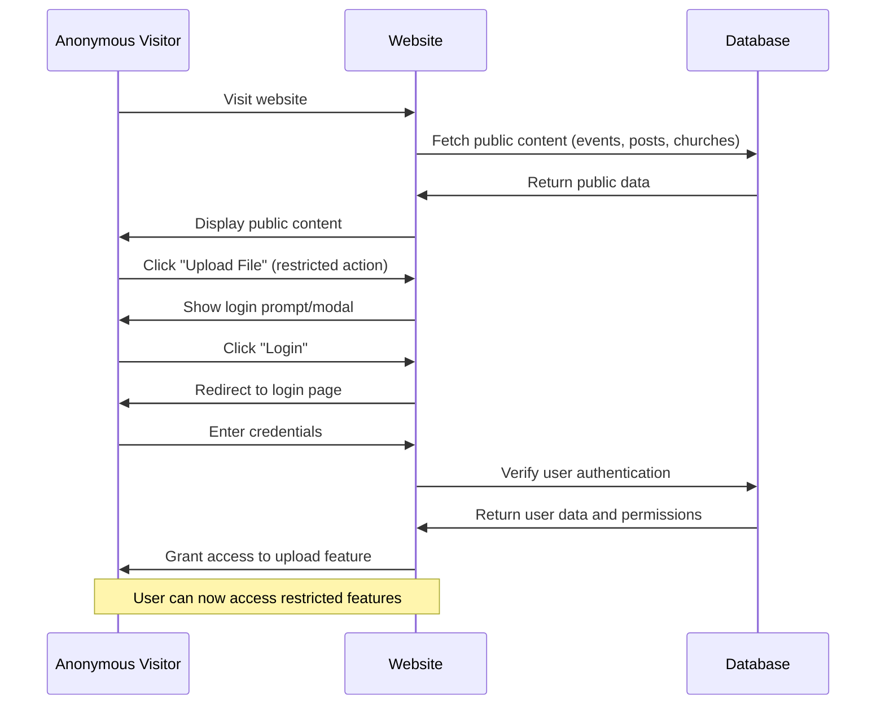
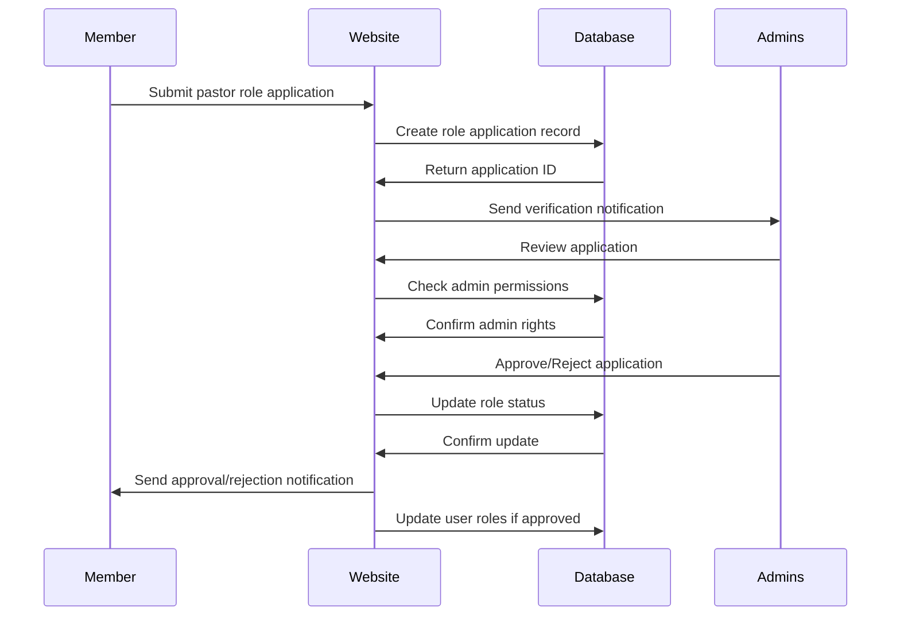
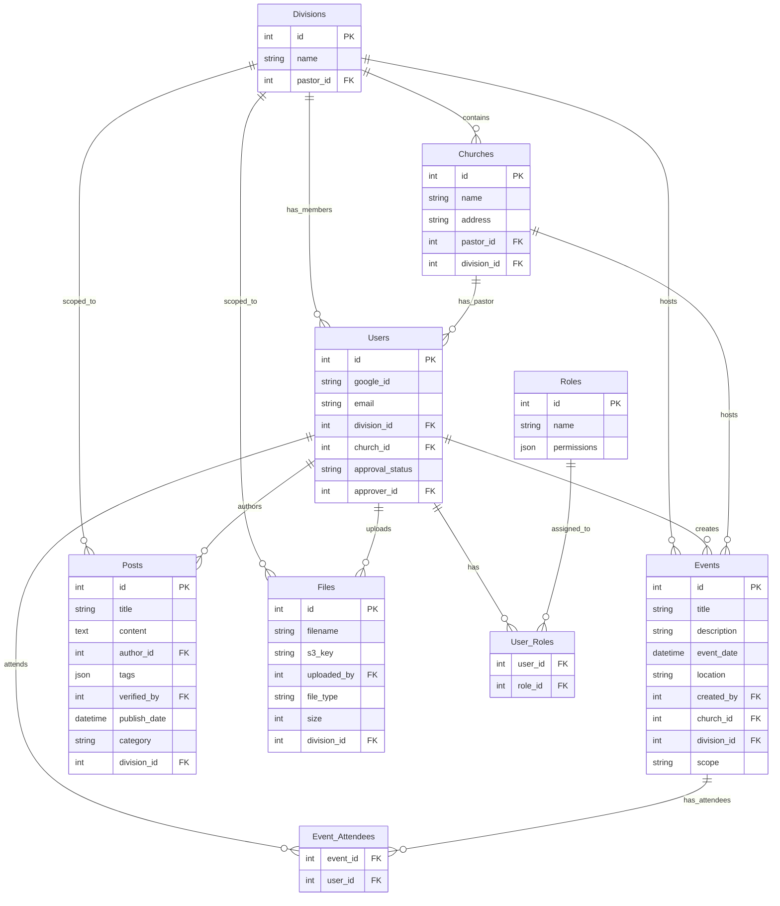
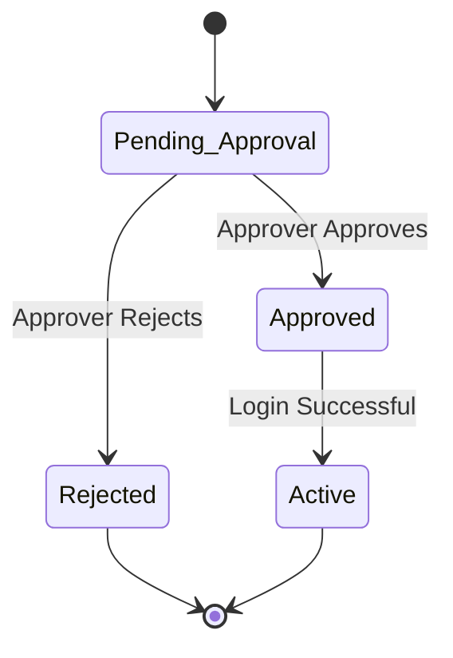
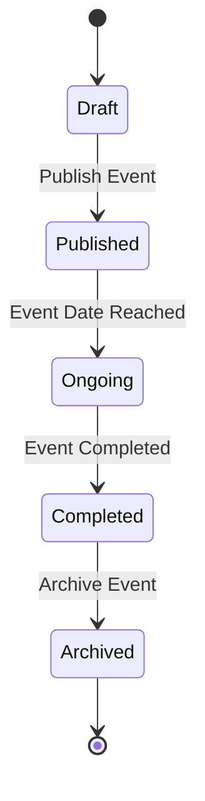
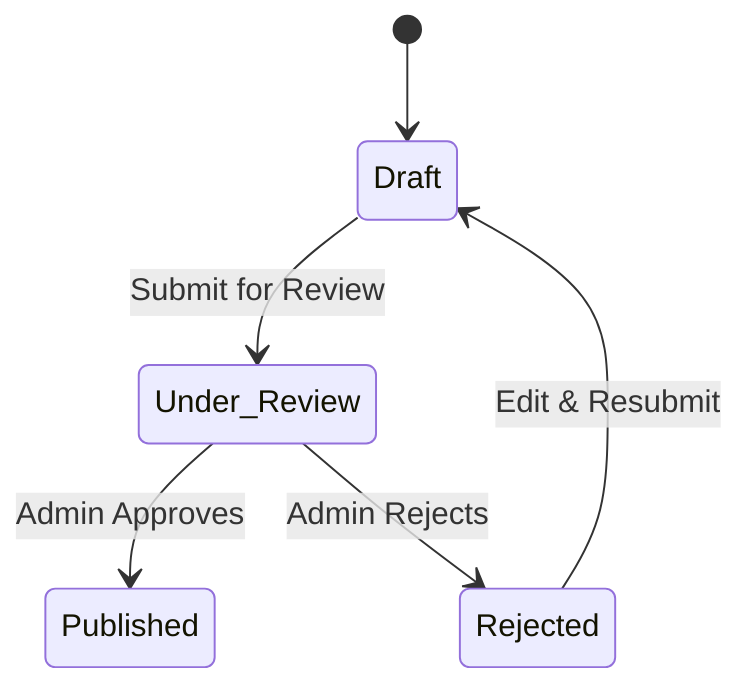
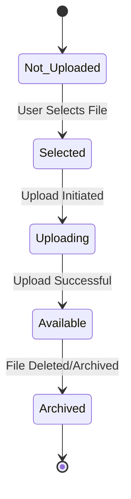

# **PHASE 4 — System Modeling (UML)**

## 4.1 Context Model

System Context Diagram (Input, Process, Output arrows and System at the center)

**System Context Diagram:**

**Key Interactions:**
- **Anonymous Visitors** → System: Public content viewing (church directory, events, blogs, lesson studies) without registration
- **SDA Members & Pastors** → System: Registration, login, profile management, event participation, content creation
- **Church Treasurers** → System: Financial reporting, member management
- **SDA Admins** → System: Content management, user administration, role verification
- **System** → AWS Services: Authentication, file storage, database operations
- **System** → External SDA Resources: Lesson materials integration

## 4.2 Interaction Model

Sequence Diagram

**User Registration & Approval Sequence:**

**Event Creation & Notification Sequence:**

**Anonymous Content Access & Optional Authentication Sequence:**

**Role Application & Verification Sequence:**

## 4.3 Structural Model

Class Diagram / ER Diagram

**Entity-Relationship Diagram:**

**Key Relationships:**
- Divisions have many Churches, Users, Events, Posts, and Files
- Users belong to Divisions and Churches, have multiple Roles
- Churches have Events and a designated pastor
- Events have attendees and can be scoped to divisions or province-wide
- Users can create Posts and upload Files
- All content supports division-level scoping for proper access control

## 4.4 Behavioral Model

State Machine Diagram

**User Account Approval State Machine:**

**Event Lifecycle State Machine:**

**Post Publication State Machine:**

**File Upload State Machine:**

These UML models provide a comprehensive view of the Nueva Vizcaya SDA Website system architecture, showing how different user types interact with the system, the step-by-step processes, the data relationships, and the state transitions throughout the application lifecycle.
