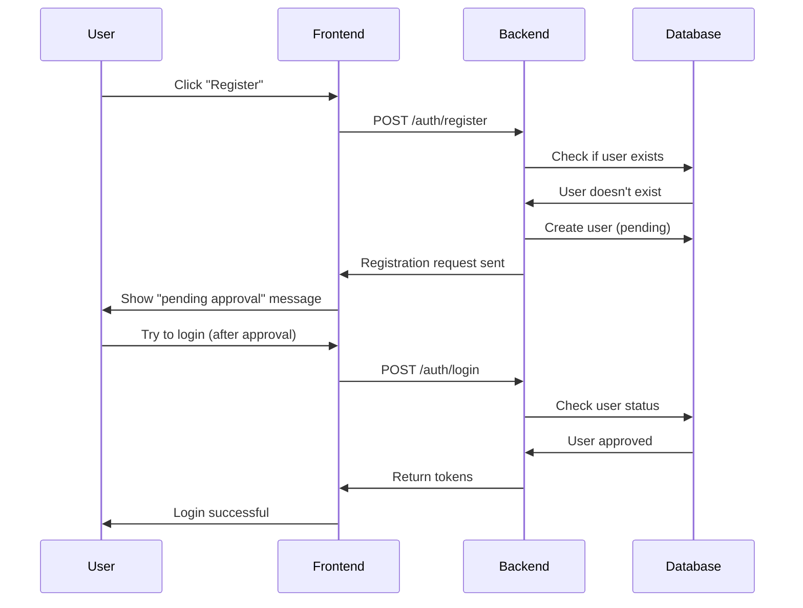

# SDA Website API Documentation

This document provides an overview of the API endpoints for the Nueva Vizcaya SDA Church website. Think of APIs as messengers that carry information between the website (frontend) and the computer brain (backend).

## Available Endpoints

### Authentication APIs
- **[POST /auth/register](auth-register.md)** - User registration with role selection and approver assignment
- **[POST /auth/login](auth-login.md)** - User login with email and password
- **[POST /auth/refresh](auth-refresh.md)** - Refresh access tokens
- **[GET /auth/approvers/search](auth-approvers-search.md)** - Search for eligible approvers

## How Authentication Works



## Common Information

### Base URL
All endpoints use the base URL: `http://localhost:8000` (for development)

### Authentication
Most endpoints require authentication using JWT tokens in the Authorization header:
```
Authorization: Bearer <access_token>
```

### Content Type
All requests use JSON content type:
```
Content-Type: application/json
```

### Error Codes
- `400 Bad Request`: Invalid request data
- `401 Unauthorized`: Missing or invalid authentication
- `404 Not Found`: Resource not found
- `500 Internal Server Error`: Server error

### Security Notes
- Always use HTTPS in production
- Never share your tokens
- Passwords are securely hashed
- All data is encrypted in transit

## Testing the APIs

You can test these APIs using:
- The website's login/register forms
- Tools like Postman or curl
- The automatic API documentation at `http://localhost:8000/docs` when the backend is running

## Need Help?

If something doesn't work, check:
1. Is the backend server running?
2. Are you using the correct URL and method?
3. Did you include all required fields?
4. Is your account approved?
5. Check the specific endpoint documentation for examples
