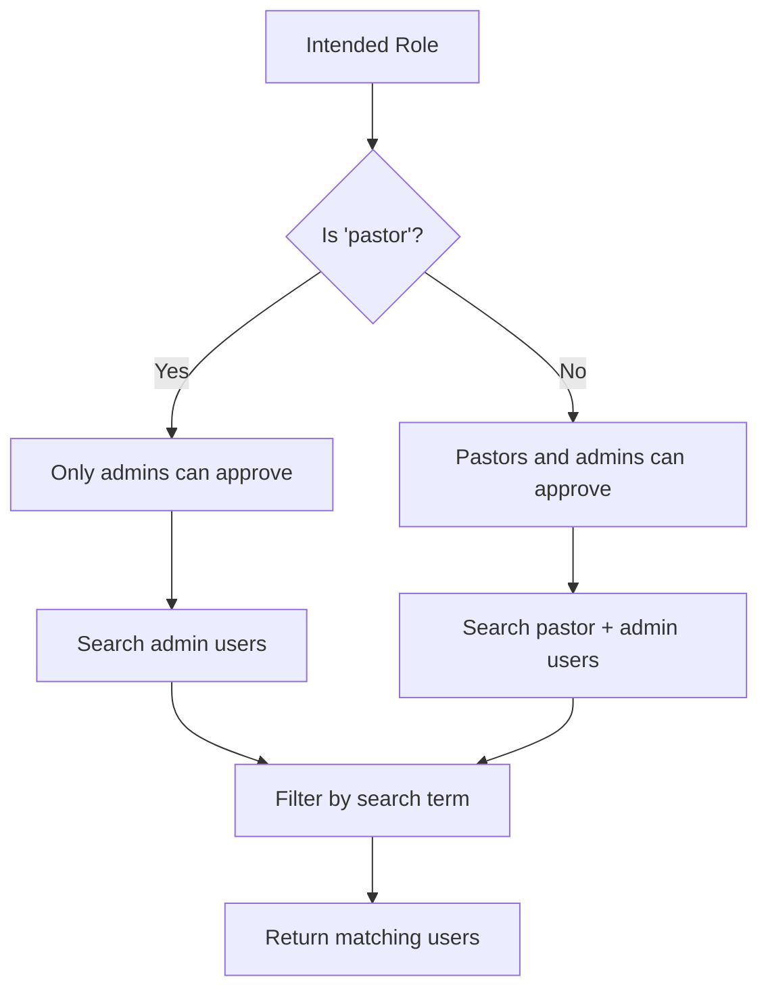

# GET /auth/approvers/search

Searches for pastors and administrators who can approve user registration requests.

## Analogy
Like looking up phone numbers in a company directory to find the right manager who can approve your job application.

## Request

**Method:** `GET`  
**Endpoint:** `/auth/approvers/search`  
**Query Parameters:**

- `role` (string, required): The role the new user is applying for (affects who can approve)
- `q` (string, required): Search term (minimum 2 characters) to match against user names/emails

### Example URLs
```
/auth/approvers/search?role=member&q=pastor
/auth/approvers/search?role=pastor&q=admin
/auth/approvers/search?role=youth&q=john
```

### Parameter Details
- `role`: Determines approval hierarchy
  - For "pastor" role applications: only users with "admin" role can approve
  - For all other roles ("member", "youth", "elder", "treasurer"): users with "pastor" or "admin" roles can approve
- `q`: Searches within user email addresses (names not currently stored separately)

## Response

### Success Response (200)
```json
[
  {
    "id": 5,
    "name": "pastor.smith@church.com",
    "email": "pastor.smith@church.com"
  },
  {
    "id": 8,
    "name": "admin.jones@church.com",
    "email": "admin.jones@church.com"
  }
]
```

### Response Fields
- `id` (integer): Unique user identifier
- `name` (string): User's display name (currently same as email)
- `email` (string): User's email address

### Empty Results (200)
```json
[]
```

### Error Responses

**Missing Parameters (422)**
```json
{
  "detail": [
    {
      "loc": ["query", "role"],
      "msg": "field required",
      "type": "value_error.missing"
    }
  ]
}
```

**Search Term Too Short (200)**
```json
[]
```

## Process Flow

1. User types in approver search box during registration
2. Frontend calls this API with search term and intended role
3. Backend determines eligible approver roles based on intended user role
4. Backend searches database for users with eligible roles
5. Backend filters results to those matching search term
6. Backend returns list of matching approvers
7. Frontend displays results for user to select

## Approval Logic



## Testing

### With curl
```bash
# Search for pastors/admins when registering as member
curl "http://localhost:8000/auth/approvers/search?role=member&q=pastor"

# Search for admins when registering as pastor
curl "http://localhost:8000/auth/approvers/search?role=pastor&q=admin"
```

### With the Website
1. Go to `/register` page
2. Start typing in the "Search for Approver" field
3. Type at least 2 characters
4. Select from the dropdown results

## Role-Based Approval Rules

| Intended User Role | Who Can Approve |
|-------------------|-----------------|
| member | pastor, admin |
| youth | pastor, admin |
| elder | pastor, admin |
| treasurer | pastor, admin |
| pastor | admin only |

## Implementation Notes

- Currently searches only email addresses (user names not stored separately)
- Results are filtered in real-time as user types
- Minimum 2 characters required to prevent excessive database queries
- Users must have appropriate roles assigned in the database
- Search is case-insensitive and supports partial matches

## Future Enhancements

- Add separate name fields to user model
- Support searching by name in addition to email
- Add pagination for large result sets
- Cache frequent search results
- Add user profile pictures to results
