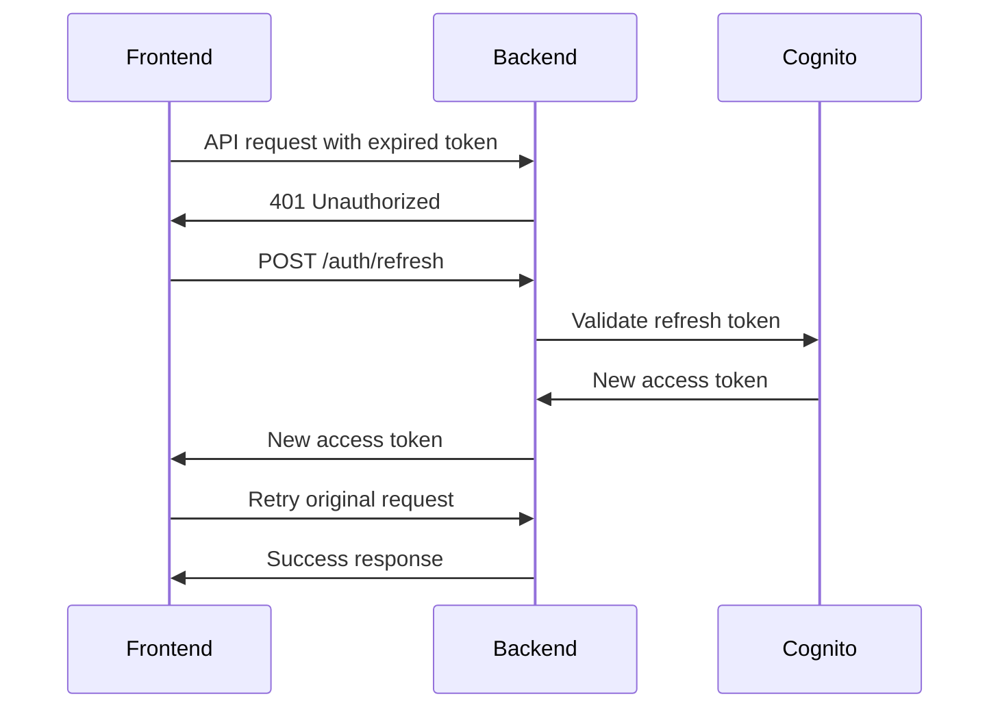

# POST /auth/refresh

Exchanges a refresh token for a new access token without requiring user credentials again.

## Analogy
Like renewing your library card before it expires. You show your old card and get a new one with an extended expiration date.

## Request

**Method:** `POST`  
**Endpoint:** `/auth/refresh`  
**Content-Type:** `application/json`

### Request Body
```json
{
  "refresh_token": "eyJ0eXAiOiJKV1QiLCJhbGciOiJIUzI1NiJ9..."
}
```

### Field Descriptions
- `refresh_token` (string, required): The long-lived refresh token obtained during login

## Response

### Success Response (200)
```json
{
  "access_token": "eyJ0eXAiOiJKV1QiLCJhbGciOiJIUzI1NiJ9..."
}
```

**Response Details:**
- `access_token`: New short-lived access token (usually 15-60 minutes validity)

### Error Responses

**Invalid Refresh Token (400)**
```json
{
  "detail": "Refresh failed"
}
```

**Expired Refresh Token (400)**
```json
{
  "detail": "Refresh failed"
}
```

## Process Flow

1. User's access token is about to expire
2. Frontend detects expired token (401 response from API)
3. Frontend sends refresh token to this endpoint
4. Backend validates refresh token with AWS Cognito
5. Cognito issues new access token
6. Backend returns new access token
7. Frontend updates stored access token
8. Original request is retried with new token

## Automatic Token Refresh Flow



## Testing

### With curl
```bash
curl -X POST "http://localhost:8000/auth/refresh" \
  -H "Content-Type: application/json" \
  -d '{
    "refresh_token": "your_refresh_token_here"
  }'
```

### Automatic in Frontend
The frontend handles token refresh automatically:
1. Makes API request
2. If 401 error, calls refresh endpoint
3. Retries original request with new token
4. User never sees the refresh process

## Token Lifecycles

- **Access Token**: 15-60 minutes (frequent refresh needed)
- **Refresh Token**: Days to weeks (long-lived, secure storage required)

## Security Considerations

- Refresh tokens should be stored securely
- Use HTTP-only cookies for refresh tokens in production
- Refresh tokens can be revoked if compromised
- Failed refresh attempts should trigger re-authentication

## When to Use

- When access token expires (401 responses)
- Before making important API calls
- Periodically to maintain valid session
- Never on page load (only when needed)

## Notes

- Refresh tokens are more sensitive than access tokens
- Store refresh tokens securely (HTTP-only cookies recommended)
- Handle refresh failures by redirecting to login
- Some applications refresh tokens proactively before expiration
